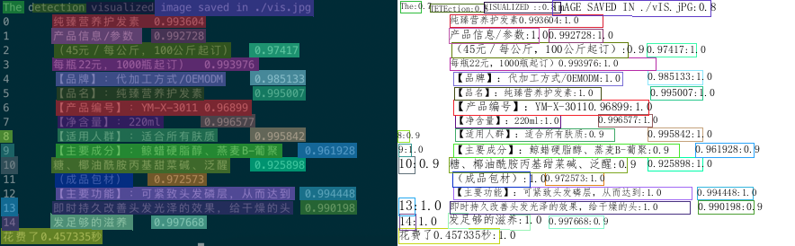

此示例用于演示带有二级结构的节点系统。

> prototype 阶段


## 执行
执行 `python ocr.py` 即可启动推理。最终，在目录下生成可视化结果：




目前的实现还比较简单，只做演示，非线上可用版本。
 

## 说明
- 缩小模型输入范围有助于提高性能：
```bash
/opt/tensorrt/bin/trtexec --onnx=onnx/rec_sim.onnx --shapes=x:1x3x32x256 --workspace=64000 \
            --minShapes=x:1x3x32x32  \
            --optShapes=x:1x3x32x256  \
            --maxShapes=x:4x3x32x256 
        time used: 2.52214ms

/opt/tensorrt/bin/trtexec --onnx=onnx/rec_sim.onnx --shapes=x:1x3x32x256 --workspace=64000 \
        --minShapes=x:1x3x32x32  \
        --optShapes=x:1x3x32x256  \
        --maxShapes=x:1x3x32x256 
    time used: 1.71951ms    
```
- todo: 将文字行按照长宽比进行排序聚合。默认最多等待1.5*"max"个数据，并从中选择和最旧数据长宽比最接近的至多"max"个数据（SortSchedule）。
- 由于官方不建议batch维度和长宽维度同时动态变化，我们采用多个固定batch尺度的方式优化。
- 如果遇到pillow相关错误，可以重新安装 pillow:
```bash
pip install pillow --force-reinstall
```
- todo 多客户端测试


- 模型转换参考官方[pp2onnx](pp2onnx.md). 