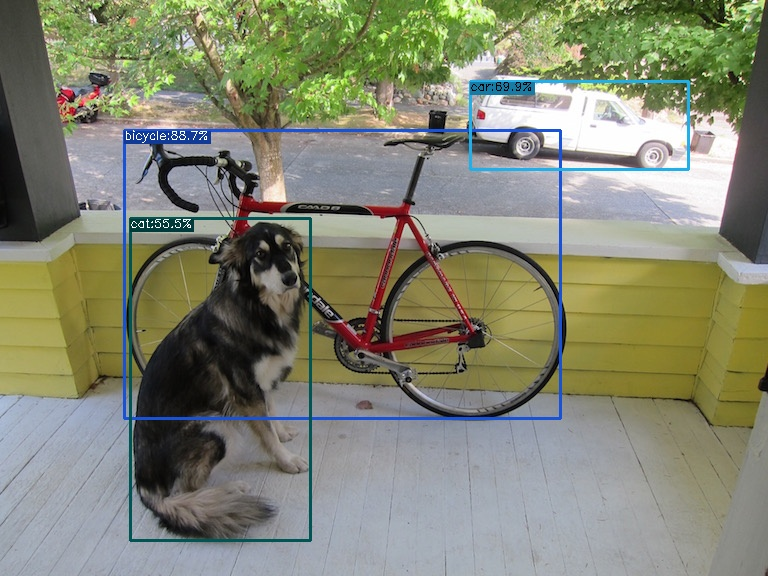

 
> Reference to [yolox](https://github.com/Megvii-BaseDetection/YOLOX/tree/main/demo/ONNXRuntime) for model conversion under dynamic batch:

```bash
python3 tools/export_onnx.py --output-name yolox_tiny.onnx -f exps/default/yolox_tiny.py -c yolox_tiny.pth --dynamic
```

## Execution
Execute `python yolox.py` to start the inference. Finally, the visualization result (left `dog_result.jpg`, right official result) will be generated in the directory.




GitHub Copilot: ## AOT Compilation Process
To compile with custom backend and post-processing defined in `csrc/yolox.cpp`, follow the steps below:

```python
torchpipe.utils.cpp_extension.load(name="yolox", sources=["./yolox.cpp"])
```
GitHub Copilot: In the post-processing, we accelerated the sorting process.

## Speed Test

run 
```python
python yolox.py --config=yolox.toml --bench
```
Test results (1080Ti):

 |      Project       |            Value             |
|:------------------:|:----------------------------:|
|   tool's version   |          20230421.0          |
|    num_clients     |              10              |
|    total_number    |            10000             |
|  throughput::qps   |            637.11            |
|  throughput::avg   |           15.7(ms)           |
|   latency::TP50    |            14.44             |
|   latency::TP90    |            17.07             |
|   latency::TP99    |            60.87             |
|    latency::avg    |            15.68             |
| -50,-40,-20,-10,-1 | 70.6,71.54,76.2,257.01,267.8 |
