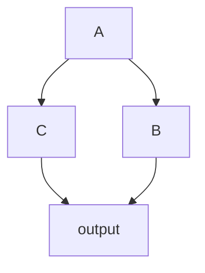

# Links between multiple nodes
 
## Serial Nodes
The `Sequential[DecodeMat,ResizeMat]` backend can be represented in a multi-node manner as follows:
```toml
# irrelevant parameters are ignored 
[decode]
# highlight-next-line
next="resize"

[resize]
```


The `decode->resize` forms a directed acyclic graph consisting of two nodes, where `decode` is the root node and `resize` is the child node.


## Multiple Branches

If a node has multiple subsequent nodes, they can be separated by commas in the `next` field.

Consider the following multi-node system:


 
The node relationship can be represented as:

```toml
# irrelevant parameters are ignored 
[A]
# highlight-next-line
next="B,C"
[B]
next="output"
[C]
next="output"
[output]
```

## Data Flow
The original input `dict` data is processed by node `A`, and both nodes `B` and `C` request data from node `A`. To avoid accessing modified data, both nodes `B` and `C` make a copy of the data from node `A`.


## map: Collecting Data from Preceding Nodes {#map}
```toml
# irrelevant parameters are ignored 
[output]
# highlight-next-line
map="B[result:B_result],C[result:data]"
```
The `output` configuration uses `map` to map the `result` of node B to its own `B_result`, and the `result` of node C to `data`. 

`map` can also map multiple key-value pairs from preceding nodes to itself, such as `map="B[1:0,1:1,2:data]"`.

If there is no ambiguity, the node name can be omitted in `map`, such as `map="[result:data]"`.

Note:

- The combined data must include `data`.
- Like `next`, `map` also creates a reference to the source node. If a node is referenced by two or more subsequent nodes, its data will be copied when requested by the subsequent nodes.
- When requesting data through `map`, the source data is always copied.
 
